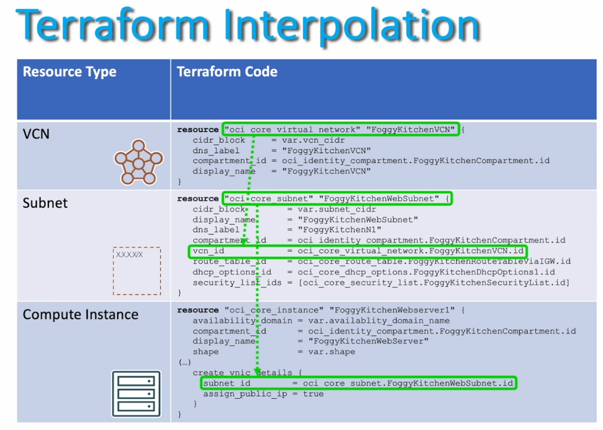

# TEST_OCI_DevOps

## Terraform providers
Terraform provider is a plugin responsible for managing API integrations and exposing cloud resources for automation.

Some sevice that Terraform support in ``IasS``

- IaaS: OCI, AWS, GCP, Azure, OpenStack 


## Terraform variables

Terraform variables allow to parameterize your configurations, making more dinamic and flexible. 
Varable declarations are typically placed in a file named variables.tf.

#### Variable delaclaration example:
Declare a vatiable vcn_cidr with a type string and default value.
```sh
variable "vcn_cidr" {
  type = "string"
  default     = "10.0.0.0/16"
}
```

#### Using variables:

Uses the variable in a resource configuration by referencing `var.<name>`
```sh
resource
"oci_core_virtual_network"
"MyVCN"{
cidr_block = var.vcn_cidr
(...)
}
```

#### Input Values
Pass values dynamically during the Terraform run using the -var flag.
```sh
terraform apply - 
var="vcn_cidr"=192.168.0.0/16"
```

# Conditional in Terraform
Conditionals in Terraform allow you make decisions dynamically within your configuration
This is particulary useful for resource creation, assing values, or enabling or disabling feature

### Conditional resource creation example:
In the next code show a terraform contional code, in this code the ``count`` evaluates the condition. If create_instances is true, the ``resource`` is created, otherwise, it is skipped.

```sh
variable "create_instance" {
        default = true
}

resource "oci_core_instance" "example" {
    count = var.create_instance ? 1 : 0
    display_name = "ExampleInstance"
    compartment_id = var.compartment_id
}

```
Note: Conditionals in terraform allow to make your configuration dynamic and efficient.

# Terraform loops
Loops in terraform enable the effcient creation of resource or dynamic generation of values:

There are two kinds of for: 
- ``count``: When you need it a sequential values/
- ``for_each``: Whe you need it to use a maps o sets to value generation. 

### Example using ``count``
The next example code, show how to create 3 indentical instances, with unique names like: 
- webserver-0
- webserver-1
- webserver-2
```sh
resource "oci_core_isntance" "webserver" {
    count = 3
    display_name = "webserver-${count.index}"
    compartment_id = var.compartment_id
}
```

### Example using ``for_each``
The next example code show loops through the instances map, creating instances for web1 and web2 with a specific availability doomains.
```sh
variable "instaces" {
    default = {"web1" = "AD-1" "web2" = "AD-2"} 
}

resource "oci_core_instance" "example" {
    for_each = var.instances
    display_name = each.key
    availability_domain = each.value
    compartiment_id = var.compartment_id
}
```


# Terraform Resource

The most important thing than you can configure with terraform are the ``resources``

The ``resources`` are the component of your insfrastructure, this resource can be low-level componnents as networks and subnets. or can be too high-leve componnents like database, instance, DNS providers , etc.

### Terraform resource interpolation 

Terraform interpolation allow you to connect resource by reference like attributes, variables, or outputs, you can dynamically pass values, can create functions and dependencies between resources.

Terraform automatically build dependency graph, ensuring that the ``resources`` are ``provicioned`` in correct order

Example: 
To create a instances resource you need to has created others resource before, and to be able to call in another part of you terraform script.

- VCN
    - Subnet
        - Instances




## Terraform DataSource

Terraform DataSource enable you to query and retrieve existing resources or information about your infrastructure.
Think of ``Datasource`` like  the equivalent of running a ``select`` query in a Database, while the resource are similar to performing DML operations like a INSERT, UPDATE, OR DELETE.

### EXAMPLE Data Source Declaretion
Declares a ``data source`` to fetch existing availability domain details in OCI

```sh
data "oci_identity_availability_domain" "AD1" {
    compartment_id = var.compartment_id
    name = "AD-1"
}
```

### EXAMPLE: Using Data Source
Uses the ``Data Source`` resuslt dynamically in a resource to retrive the availability domain nane

```sh
resource "oci_core_subnet" "example" {
    cidr_block = "10.0.0.0/24"
    availability_domain = data.oci_identity_availability_domain.AD1.name
}
```

### Conparison to resources
In Terrafom the ``resource`` are to create or modify infrastruture and the ``Data Source``  are to running query and use the existing infrastructure data.

Highlights the distinction between resources and data sources. 
``Data source`` are ``read-only``